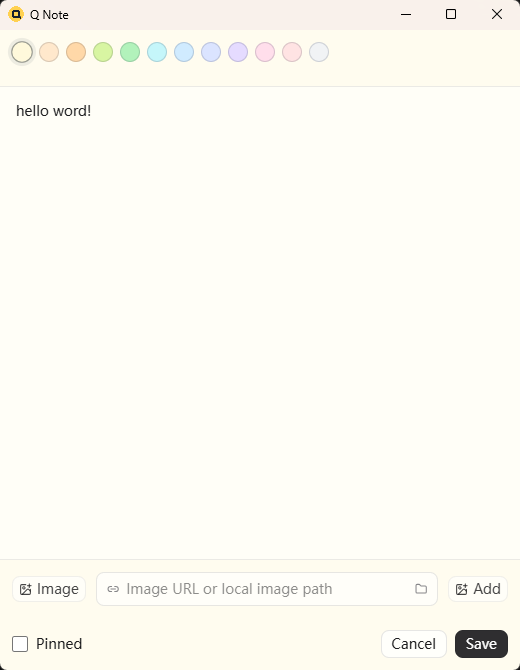

<p align="center">
  
</p>

<h1 align="center">Q Note</h1>

<p align="center">
  A compact desktop note board for snippets, images, links, and local paths you reuse often.
</p>

<p align="center">
  <a href="./README.zh-CN.md">中文说明</a>
</p>

## Screenshots

| Main board                                                                      | Editor window                                                                        |
| ------------------------------------------------------------------------------- | ------------------------------------------------------------------------------------ |
|  |  |

## Overview

Q Note is a small Tauri desktop app for keeping short notes close to your cursor. It is built for quick capture and repeated copy workflows: save text snippets, screenshots, image URLs, local file paths, and small reference notes; pin the important ones; drag cards into the order you want; mark cards with color; and collapse the whole app into a tiny floating Q icon when you need the screen space.

The interface stays intentionally compact. The main board is a narrow yellow panel with a short toolbar, card list, tray integration, always-on-top mode, and a floating icon mode that can snap to desktop edges while staying partly visible. Editing happens in a separate window so the main panel does not resize or jump.

## Quick Start

```bash
pnpm install
pnpm tauri dev
```

## Commands

| Command             | Purpose                     |
| ------------------- | --------------------------- |
| `pnpm dev`          | Start the Vite dev server   |
| `pnpm tauri dev`    | Start the Tauri desktop app |
| `pnpm typecheck`    | Run TypeScript build checks |
| `pnpm check`        | Run Vite+ checks            |
| `pnpm check:fix`    | Fix Vite+ check issues      |
| `pnpm format`       | Format with Vite+           |
| `pnpm format:check` | Check formatting            |
| `pnpm build`        | Build the frontend          |

## Features

| Feature            | Details                                                                                                                        |
| ------------------ | ------------------------------------------------------------------------------------------------------------------------------ |
| Compact note board | Keep frequently used snippets in a narrow, always-available desktop panel                                                      |
| Quick copy         | Click a card to copy its text; attachment-only notes copy attachment values                                                    |
| Card management    | Create, edit, delete, pin, recolor, resize, and drag-sort note cards                                                           |
| Drag sorting       | Reorder cards with a drag overlay; crossing the pinned boundary automatically pins or unpins the card                          |
| Separate editor    | Create and edit notes in an independent editor window without changing the main panel size                                     |
| Images and files   | Add images, drop files/images, paste screenshots, use web image URLs, local paths, and base64 fallback data                    |
| Image preview      | Click editor thumbnails to view a larger image                                                                                 |
| Floating Q icon    | Collapse to a 30px Q icon, drag it, snap it to screen edges, show half at the edge, and reveal it on hover                     |
| Dual-monitor edges | Edge snapping avoids unstable cross-screen offsets by clipping the Q icon inside the current screen                            |
| Topmost window     | Toggle always-on-top from the toolbar, right-click menu, or tray menu                                                          |
| Tray icon          | Keep a resident Q icon in the system tray; click it to show the app                                                            |
| Language switch    | Toggle Chinese and English from the toolbar; the choice is saved locally                                                       |
| Launch at login    | Enable or disable startup launch from Settings; it is off by default                                                           |
| Persistence        | Notes, attachments, colors, card order, card heights, window size, topmost state, language, and dock state are saved in SQLite |
| Import/export      | Export and import notes plus local settings as JSON                                                                            |

## Stack

| Area          | Tooling                                               |
| ------------- | ----------------------------------------------------- |
| Desktop shell | Tauri 2                                               |
| Frontend      | React 19 + TypeScript                                 |
| Build         | Vite 8 + Vite+                                        |
| Styling       | Tailwind CSS 4 + CSS                                  |
| Drag sorting  | dnd-kit                                               |
| Storage       | SQLite + `@tauri-apps/plugin-sql` + Drizzle proxy     |
| Files         | `@tauri-apps/plugin-dialog` + `@tauri-apps/plugin-fs` |
| Icons         | lucide-react + yellow Q app icon                      |

## Packaging

Release builds are generated by GitHub Actions with Tauri's release build pipeline. Pushing a `v*` tag publishes a GitHub Release with Windows, macOS, and Linux artifacts, including NSIS/MSI, DMG, AppImage, DEB, and RPM where supported. The Windows NSIS installer uses `src-tauri/icons/icon.ico` for both installer and uninstaller icons.

## Data Location

Q Note stores its SQLite database in the user home folder:

| Platform    | Path                                    |
| ----------- | --------------------------------------- |
| Windows     | `C:\Users\<username>\.q-note\q-note.db` |
| macOS/Linux | `~/.q-note/q-note.db`                   |

If an older Windows install already has data in `%APPDATA%\com.win11.q-note\q-note.db`, Q Note copies it to the new location on first launch.

## License

[MIT](./LICENSE)
