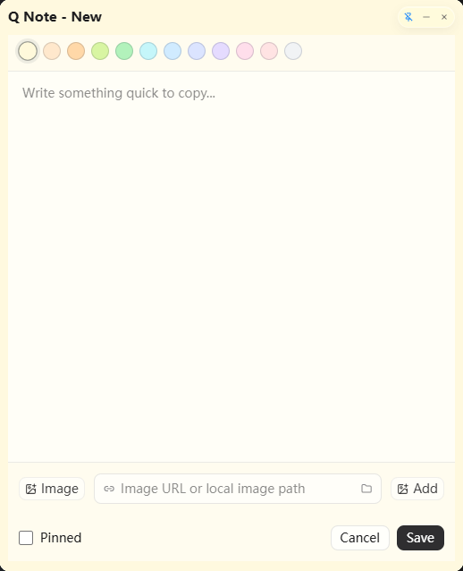

<p align="center">
  
</p>

<h1 align="center">Q Note</h1>

<p align="center">
  A compact desktop note board for snippets, images, links, and local paths you reuse often.
</p>

<p align="center">
  <a href="./README.zh-CN.md">中文说明</a>
</p>

## Screenshots

| Main board                                                                      | Editor window                                                                        |
| ------------------------------------------------------------------------------- | ------------------------------------------------------------------------------------ |
|  |  |

## Overview

Q Note is a small Tauri desktop app for keeping short notes close to your cursor. It is built for quick capture and repeated copy workflows: save text snippets, screenshots, image URLs, local file paths, and small reference notes; pin the important ones; drag cards into the order you want; mark cards with color; and collapse the whole app into a tiny floating Q icon when you need the screen space.

The interface stays intentionally compact. The main board is a narrow yellow panel with a short toolbar, card list, tray integration, always-on-top mode, and a floating icon mode that can snap to desktop edges while staying partly visible. Editing happens in a separate window so the main panel does not resize or jump.

## Quick Start

```bash
pnpm install
pnpm tauri dev
```

## Commands

| Command              | Purpose                                   |
| -------------------- | ----------------------------------------- |
| `pnpm dev`           | Start the Vite dev server                 |
| `pnpm tauri dev`     | Start the Tauri desktop app               |
| `pnpm typecheck`     | Run TypeScript build checks               |
| `pnpm test`          | Run the Node test suite                   |
| `pnpm check`         | Run Vite+ checks                          |
| `pnpm check:fix`     | Fix Vite+ check issues                    |
| `pnpm format`        | Format with Vite+                         |
| `pnpm format:check`  | Check formatting                          |
| `pnpm build`         | Build the frontend                        |
| `pnpm release:patch` | Bump patch version, commit, tag, and push |
| `pnpm release:minor` | Bump minor version, commit, tag, and push |
| `pnpm release:major` | Bump major version, commit, tag, and push |

## Release

Maintainers can cut a release with one command:

```bash
pnpm release:patch   # 0.2.5 -> 0.2.6
pnpm release:minor   # 0.2.5 -> 0.3.0
pnpm release:major   # 0.2.5 -> 1.0.0
```

Each release command:

1. Bumps the version in `package.json`, `src-tauri/Cargo.toml`, and `src-tauri/tauri.conf.json`.
2. Runs `scripts/sync-cargo-lock.mjs` to refresh the `q-note` entry in `src-tauri/Cargo.lock`.
3. Creates a `release: vX.Y.Z` commit and `vX.Y.Z` tag, then pushes both to `origin`.

The release script uses `bumpp` with `--all` so `Cargo.lock` is included in the same release commit. Do not remove `--all`; without it, only the version files are committed.

Pushing a `v*` tag triggers [`.github/workflows/release.yml`](./.github/workflows/release.yml), which builds Windows, macOS, and Linux artifacts, publishes a GitHub Release, and uploads `latest.json` for the in-app updater.

## Features

| Feature            | Details                                                                                                                        |
| ------------------ | ------------------------------------------------------------------------------------------------------------------------------ |
| Compact note board | Keep frequently used snippets in a narrow, always-available desktop panel                                                      |
| Quick copy         | Click a card to copy its text; attachment-only notes copy attachment values                                                    |
| Card management    | Create, edit, delete, pin, recolor, resize, and drag-sort note cards                                                           |
| Drag sorting       | Reorder cards with a drag overlay; crossing the pinned boundary automatically pins or unpins the card                          |
| Separate editor    | Create and edit notes in an independent editor window without changing the main panel size                                     |
| Images and files   | Add images, drop files/images, paste screenshots, use web image URLs, local paths, and base64 fallback data                    |
| Image preview      | Click editor thumbnails to view a larger image                                                                                 |
| Floating Q icon    | Collapse to a 30px Q icon, drag it, snap it to screen edges, show half at the edge, and reveal it on hover                     |
| Dual-monitor edges | Edge snapping avoids unstable cross-screen offsets by clipping the Q icon inside the current screen                            |
| Topmost window     | Toggle always-on-top from the toolbar, right-click menu, or tray menu                                                          |
| Tray icon          | Keep a resident Q icon in the system tray; click it to show the app                                                            |
| Language switch    | Toggle Chinese and English from the toolbar; the choice is saved locally                                                       |
| Launch at login    | Enable or disable startup launch from Settings; it is off by default                                                           |
| Persistence        | Notes, attachments, colors, card order, card heights, window size, topmost state, language, and dock state are saved in SQLite |
| Import/export      | Export and import notes plus local settings as JSON                                                                            |

## Stack

| Area          | Tooling                                                        |
| ------------- | -------------------------------------------------------------- |
| Desktop shell | Tauri 2                                                        |
| Frontend      | Vue 3.6 Vapor + TypeScript + `<script setup>`                  |
| Build         | Vite 8 + Vite+                                                 |
| Styling       | Tailwind CSS 4 + CSS                                           |
| Drag sorting  | vue-draggable-plus + SortableJS                                |
| Storage       | SQLite + `@tauri-apps/plugin-sql` + Drizzle proxy              |
| Files         | `@tauri-apps/plugin-dialog` + `@tauri-apps/plugin-fs`          |
| Icons         | Lucide icon data rendered by a native Vapor component + Q icon |

Every Vue SFC is explicitly compiled in Vapor mode. Application state lives in Vue composables built with `ref`, `computed`, `watch`, and Vue lifecycle hooks; the project does not ship a React runtime or a VDOM compatibility layer. See [Vue Vapor architecture](./docs/vue-vapor-migration.md) for implementation details.

## Packaging

Release builds are generated by GitHub Actions. See [Release](#release) for the maintainer workflow.

Windows NSIS/MSI, macOS DMG, and Linux AppImage/DEB/RPM artifacts are published to GitHub Releases. The Windows NSIS installer uses `src-tauri/icons/icon.ico` for both installer and uninstaller icons.

## macOS App Trust

Q Note is not currently signed or notarized with an Apple Developer ID certificate. macOS may show a warning such as "Q Note is damaged and can't be opened" after installation. If you downloaded Q Note from the official GitHub Release and trust the app, you can allow it manually:

1. Open **System Settings**.
2. Go to **Privacy & Security**.
3. Scroll to the Security section and choose **Open Anyway** for Q Note if the prompt appears.
4. Alternatively, right-click **Q Note.app** and choose **Open**, then confirm the warning dialog.

If macOS still blocks the app, remove the download quarantine flag in Terminal:

```bash
sudo xattr -rd com.apple.quarantine "/Applications/Q Note.app"
open "/Applications/Q Note.app"
```

Only run the command for an app package you downloaded from a trusted release page.

## Data Location

Q Note stores its SQLite database in the user home folder:

| Platform    | Path                                    |
| ----------- | --------------------------------------- |
| Windows     | `C:\Users\<username>\.q-note\q-note.db` |
| macOS/Linux | `~/.q-note/q-note.db`                   |

If an older Windows install already has data in `%APPDATA%\com.win11.q-note\q-note.db`, Q Note copies it to the new location on first launch.

## License

[MIT](./LICENSE)
